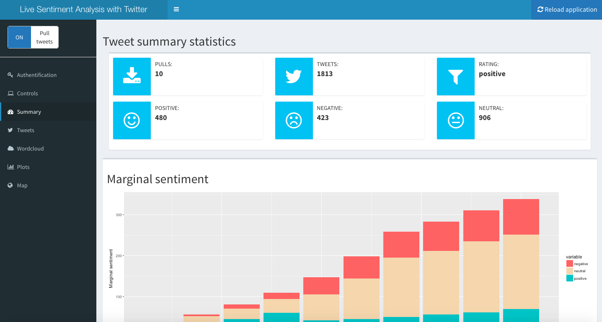

# livesentiment

Sentiment analysis of real time twitter feeds in R. I wrote this package for a Master's seminar in Statistics.

This R package provides an interactive user interface based on Shiny for analyzing the polarity of real time twitter feeds.
Having a twitter account and creating a twitter oauth in R is necessary prior to being able to use this package.

The following link provides a tutorial on how to create a twitter oath in R.
http://pablobarbera.com/big-data-upf/html/02d-twitter-streaming-data-collection.html

After saving your authentification credentials as an ```.rdata file```, you can start the application with the ```liveSentiment()``` call and load your ```<my_oauth>.rdata``` file in the ```Authentification``` tab.

&nbsp;


